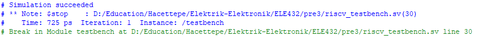
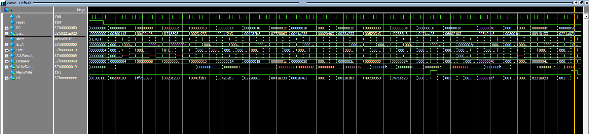
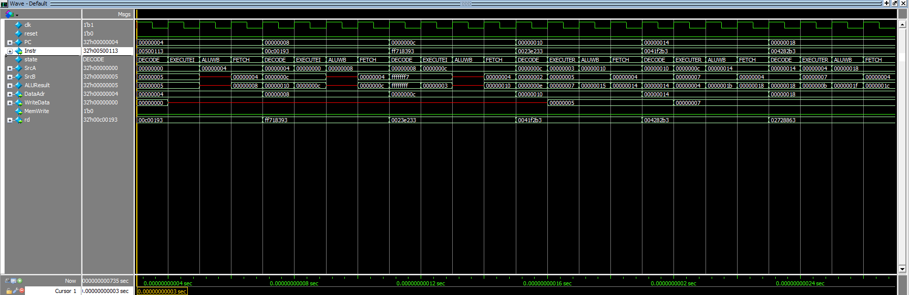

# ELE 432 Lab 3: Multicycle RISC-V Processor

This repository contains the SystemVerilog RTL implementation, testbench, and simulation results for a **Multicycle RISC-V Processor**. This project was developed as Preliminary Work 3 for the ELE 432 (Digital Design & Computer Architecture) course at Hacettepe University.

## Project Description
The processor is designed using a multicycle architecture, which divides the execution of an instruction into multiple clock cycles (FETCH, DECODE, EXECUTE, MEMORY, WRITEBACK). This design utilizes a **Unified Memory** for both instructions and data, significantly improving hardware utilization compared to single-cycle designs.

## Instruction Decode Reference
The following table shows the assembly instructions used in the test program and their corresponding machine codes loaded into memory.

| Machine Code | Assembly | Type | Operation | Notes |
| :--- | :--- | :--- | :--- | :--- |
| `00500113` | addi x2, x0, 5 | I-type | x2 ← 0 + 5 = 5 | Initial load |
| `00C00193` | addi x3, x0, 12 | I-type | x3 ← 0 + 12 = 12 | Initial load |
| `FF718393` | addi x7, x3, -9 | I-type | x7 ← 12 + (-9) = 3 | |
| `0023E233` | or x4, x7, x2 | R-type | x4 ← 3 \| 5 = 7 | |
| `0041F2B3` | and x5, x3, x4 | R-type | x5 ← 12 & 7 = 4 | |
| `004282B3` | add x5, x5, x4 | R-type | x5 ← 4 + 7 = 11 | |
| `02728863` | beq x5, x7, +40 | B-type | x5(11) != x7(3) | Not taken |
| `0041A233` | slt x4, x3, x4 | R-type | x4 ← (12 < 7) = 0 | |
| `00020463` | beq x4, x0, +8 | B-type | x4(0) == x0(0) | Taken, skip next |
| `00000293` | addi x5, x0, 0 | I-type | - | SKIPPED |
| `0023A233` | slt x4, x7, x2 | R-type | x4 ← (3 < 5) = 1 | |
| `005203B3` | add x7, x4, x5 | R-type | x7 ← 1 + 11 = 12 | |
| `402383B3` | sub x7, x7, x2 | R-type | x7 ← 12 - 5 = 7 | |
| `0471AA23` | sw x7, 84(x3) | S-type | MEM[12+84] ← 7 | Store result |
| `06002103` | lw x2, 96(x0) | I-type | x2 ← MEM[96] = 7 | Load result |
| `005104B3` | add x9, x2, x5 | R-type | x9 ← 7 + 11 = 18 | |
| `008001EF` | jal x3, 8 | J-type | x3 ← 68, PC ← 0x48 | Jump |
| `00100113` | addi x2, x0, 1 | I-type | - | SKIPPED |
| `00910133` | add x2, x2, x9 | R-type | x2 ← 7 + 18 = 25 | Final calc |
| `0221A023` | sw x2, 32(x3) | S-type | MEM[68+32] ← 25 | Success condition |
| `00210063` | beq x2, x1, +0 | B-type | - | End loop |

## Expected Operation Table
The table below tracks the state transitions and register updates for the first few instructions after reset.

| Step | PC (Hex) | Instr (Hex) | State | Result (Hex) | Reg. Written | Notes |
| :--- | :--- | :--- | :--- | :--- | :--- | :--- |
| 1 | 00 | X | RESET | X | - | Reset asserted |
| 2 | 00 | X | RESET | X | - | Reset asserted |
| 3 | 00 | 00500113 | FETCH | 04 | - | PC = PC + 4 |
| 4 | 04 | " | DECODE | X | - | A = x0 = 0 |
| 5 | 04 | " | EXECUTEI | X | - | ALUResult = 5 |
| 6 | 04 | " | ALUWB | 05 | x2 | x2 ← 5 |
| 7 | 04 | 00C00193 | FETCH | 08 | - | PC = PC + 4 |
| 8 | 08 | " | DECODE | X | - | A = x0 = 0 |
| 9 | 08 | " | EXECUTEI | X | - | ALUResult = 12 |
| 10 | 08 | " | ALUWB | 0C | x3 | x3 ← 12 |

## Simulation Results & Waveforms

### Simulation Terminal Output
The simulation successfully completes when the value `25` (0x19) is written to the memory address `100` (0x64), which is the success condition defined in the testbench.

### Waveform Analysis
The waveforms below verify the correct execution flow and memory write operations.

**Waveform 1: Verification of the Success Condition (Address 0x64, Data 0x19)**

**Waveform 2: Verification of the Operation Table**

## Repository Structure
* **`top.sv`**: Connects the processor core and unified memory.
* **`riscv.sv`**: The processor core, including controller and datapath.
* **`controller.sv`**: Logic for FSM, ALU decoders, and immediate extenders.
* **`mainfsm.sv`**: 11-state FSM implementation.
* **`datapath.sv`**: Internal routing, registers, and ALU.
* **`utility.sv`**: Basic blocks like Muxes, Flops, and Register File.
* **`mem.sv`**: Unified memory module.

## How to Simulate
1. Compile all `.sv` files in ModelSim.
2. Load the `testbench` module.
3. Run with `vsim -voptargs="+acc" work.testbench`.
4. Observe the console for the `Simulation succeeded` message.
5. Additionaly, you can put those commands in console and see that waveform changing:
~~~
add wave -noupdate -radix binary /testbench/clk
add wave -noupdate -radix binary /testbench/reset
add wave -noupdate -radix hexadecimal /testbench/dut/core/dp/PC
add wave -noupdate -radix hexadecimal /testbench/dut/core/dp/Instr
add wave -noupdate /testbench/dut/core/c/fsm/state
add wave -noupdate -radix hexadecimal /testbench/dut/core/dp/SrcA
add wave -noupdate -radix hexadecimal /testbench/dut/core/dp/SrcB
add wave -noupdate -radix hexadecimal /testbench/dut/core/dp/ALUResult
add wave -noupdate -radix hexadecimal /testbench/dut/DataAdr
add wave -noupdate -radix hexadecimal /testbench/dut/WriteData
add wave -noupdate -radix binary /testbench/dut/MemWrite
add wave -noupdate /testbench/dut/unified_memory/rd
~~~

## Author
**Ali Özyüksel** Hacettepe University, Electrical and Electronics Engineering
